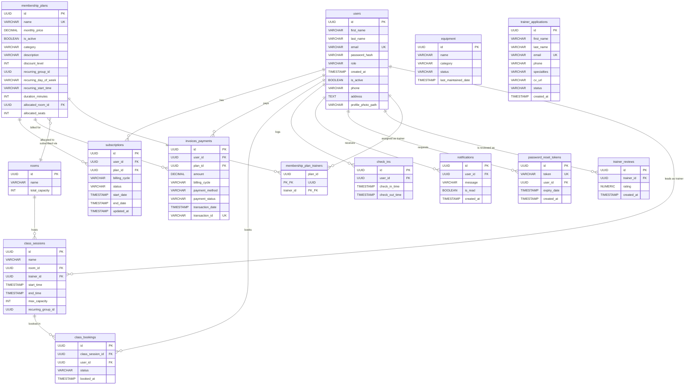

# Vortex Gym — Entity Relationship Diagram

---

## Standalone Tables (No Foreign Keys)

| Table | Reason |
|-------|--------|
| `equipment` | Global asset inventory — not tied to any user, room, or session. Managed by Admin/Staff via status updates only. |
| `trainer_applications` | Public submission form — no link to `users` by design. When an admin **approves** an application, a new `users` record is created in the application layer (not enforced as a DB constraint). |
